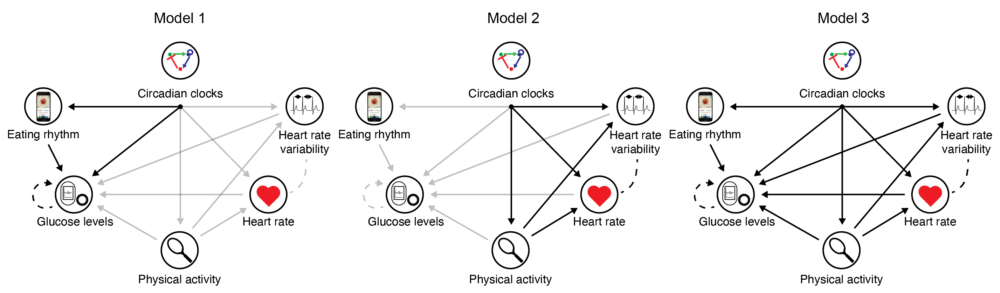

# MSS - the Multi-Sensor Study

This is the code to accompany our paper: 

Uncovering personalized glucose responses and circadian rhythms from multiple wearable biosensors with Bayesian dynamical modeling (2023) Nicholas E. Phillips, Tinh-Hai Collet\*, Felix Naef\*. Cell Reports Methods, 3, 100545 ([link](https://doi.org/10.1016/j.crmeth.2023.100545))

The goal of this computational method is to learn interpretable, personal parameters from wearable time series data to reveal circadian rhythms and physiological responses to external stressors such as meals and physical activity. The package MSS uses [TensorFlow Probability](https://www.tensorflow.org/probability).

## Overview

In our study we measured food and drink ingestion, glucose dynamics, physical activity, heart rate (HR) and heart rate variability (HRV) in 25 healthy participants over 14 days.

We subdivide the problem of analysing the multiple signals by creating three successive mathematical models, where the models include different subsets of variables.

- Model 1: food + drink events, glucose CGM, circadian
- Model 2: physical activity, HR, HRV, circadian
- Model 3: food + drink events, glucose CGM, physical activity, HR, HRV, circadian



These three different models are implemented as part of the MSS package.

## Tutorials

There are three different tutorials to help use the package:

- [tutorials/tutorial.ipynb](tutorials/tutorial.ipynb): please see the main tutorial Jupyter Notebook  to see how to perform inference using the three models.
- [tutorials/detrending raw glucose example.ipynb](tutorials/detrending%20raw%20glucose%20example.ipynb): this describes how to pre-process glucose CGM data via detrending.
- [tutorials/Why add a 24-h rhythmic baseline to glucose?.ipynb](tutorials/Why%20add%20a%2024-h%20rhythmic%20baseline%20to%20glucose%3F.ipynb): this provides an example to illustrate the motivation behind the underlying 24-hour baseline glucose rhythm in Model 1.

## Installation instructions

Please run the following code in the terminal to install the MSS package

```
git clone https://github.com/Naef-lab/MultiSensor && cd MultiSensor
conda env create -f environment.yml
conda activate MultiSensor
pip install .
```

## Citation

Uncovering personalized glucose responses and circadian rhythms from multiple wearable biosensors with Bayesian dynamical modeling (2023) Nicholas E. Phillips, Tinh-Hai Collet\*, Felix Naef\*. Cell Reports Methods, 3, 100545 ([link](https://doi.org/10.1016/j.crmeth.2023.100545))